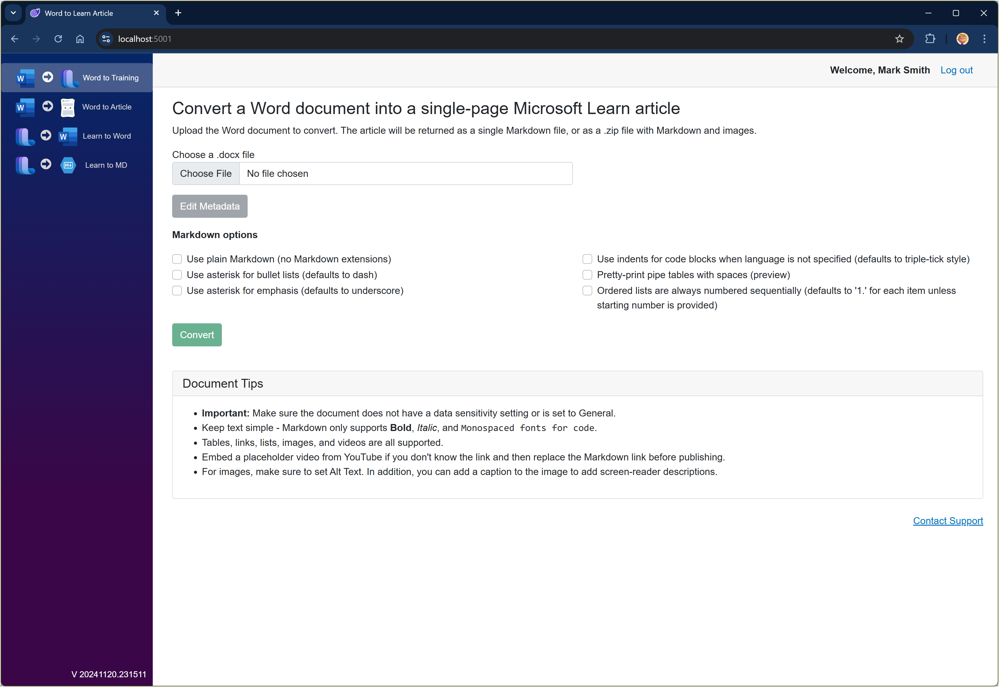

# ConvertLearnToDoc

**ConvertLearnToDoc** is a set of tools that can convert Microsoft Word documents into [Microsoft Learn](https://learn.microsoft.com) articles or training modules that can be published on the Microsoft Learn site. This is a tool primarily intended for contributors to the platform who don't want to work in Markdown or YAML, but would prefer to leverage a document. The tool has an experimental capability to load an article or training module from the <https://learn.microsoft.com> and convert it into a Microsoft Word document.

> **Important:**
> This tool does not push content into GitHub. The step to _actually_ publish content requires a GitHub account
> connected to the <https://github.com/MicrosoftDocs> organization. This tool only converts documents into the Markdown and
> YAML files necessary for publishing.

## Project structure

The GitHub repo has several related projects:

| Project | Description | Status |
|---------|-------------|--------|
| [ConvertLearnToDoc](src/ConvertLearnToDoc) | Blazor Server version of the conversion tool. This is the most current version and includes authentication through either MSA or GitHub and logging through Azure LogAnalytics. | **Active** |
| [ConvertAll](src/ConvertAll) | A CLI tool to walk a local clone of a MicrosoftDocs GitHub repository and create Word docs from each located training module. | **Active** |
| [ConvertDocx](src/ConvertDocx) | A CLI tool to convert a single Learn module or Docs page to a Word doc, or vice-versa. It can take a URL, GitHub details, or a local folder/file. | **Active** |
| [Blazor](archive/ConvertLearnToDoc) | A Blazor WebAssembly version of the conversion tool. | **Deprecated** |
| [ConvertLearnToDocWeb](archive/ConvertLearnToDocWeb) | A web portal version of the conversion tool. | **Deprecated** |
| [ConvertLearnToDoc.AzureFunctions](archive/ConvertLearnToDoc.AzureFunctions) | Azure functions to perform the document conversions, used by the above web project. | **Deprecated** |

In addition, there are four libraries used by the above projects.

| Library project | Description |
|-----------------|-------------|
| [Docx.Renderer.Markdown](lib/Docx.Renderer.Markdown) | A library to convert a .docx file to Markdown |
| [GenMarkdown.DocFX.Extensions](lib/GenMarkdown.DocFx.Extensions) | A library of [GenMarkdown](https://github.com/markjulmar/GenMarkdown) extensions to render DocFX extensions. |
| [LearnDocUtils](lib/LearnDocUtils) | The main conversion library. |
| [Markdig.Renderer.Docx](lib/Markdig.Renderer.Docx) | A Markdig library to read a Markdig document and turn it into a .docx file. |
| [DocsToMarkdown](lib/DocsToMarkdown) | A library that converts a Learn URL into Markdown. This is used to convert from Learn to Word or Markdown in the web tool. |

## Project dependencies

The project also depends on several NuGet packages:

| Package | Description |
|---------|-------------|
| [DxPlus](https://github.com/markjulmar/dxplus) | A library to read/write .docx files. |
| [GenMarkdown](https://github.com/markjulmar/genmarkdown) | A library to generate Markdown content. |
| [MSLearnRepos](https://www.nuget.org/packages/julmar.mslearnrepos) | A .NET library to work with GitHub and the Learn repo structure |
| [Markdig](https://github.com/xoofx/markdig) | A CommonMark Markdown parsing library for .NET |
| [Microsoft.DocAsCode.MarkdigEngine.Extensions](https://www.nuget.org/packages/Microsoft.DocAsCode.MarkdigEngine.Extensions) | Extensions for Markdig and DocFX. |

## Converting a Learn module to a Word document

To try out the tools locally, clone the repository and navigate to the `src\ConvertDocx` project folder. Running the tool with no parameters will list the options:

```output
Input File            Required. Input file or folder.
Output FIle           Required. Output file or folder.
-s, --singlePage      Output should be a single page (Markdown file).
-g, --Organization    GitHub organization
-r, --Repo            GitHub repo
-b, --Branch          GitHub branch, defaults to 'live'
-t, --Token           GitHub access token
-d, --Debug           Debug output, save temp files
-p, --Pivot           Zone pivot to render to doc, defaults to all
-z, --zipOutput       Zip output folder, defaults to false
-n, --Notebook        Convert notebooks into document, only used on MS Learn content
-f, --OutputFormat    The output format when the input is a URL. Valid values are [Markdown, Docx], defaults to Docx.
--help                Display help.
--version             Display version information.
```

| Option | Description |
|--------|-------------|
| First parameter | Specifies a local Learn module folder or docs Markdown page, URL to a Learn module/docs conceptual page, or a local .docx file. |
| Second parameter | Specifies a local folder or file to output a Learn module/docs page to, or a .docx filename. |
| `-z` | If supplied and converting from Learn to .docx, this will zip the generated folder. |
| `-g` | GitHub organization to get content from. This allows a fork of MicrosoftDocs to be used. |
| `-r` | Repository to pull content from. If provided, the input parameter should a folder in this repo. |
| `-b` | Optional branch if content is not public. If provided, the input parameter should a folder in this repo. |
| `-t` | GitHub token if using a URL or GitHub folder. |
| `-d` | Debug - keeps all intermediary files. |
| `-p` | Zone pivot to render when going from Learn to a .docx. If not supplied, all pivots are rendered. |
| `-n` | If supplied, any notebooks in the module will be rendered in place. |
| `-f` | Output format when the input is a URL. Valid values are [Markdown, Docx], defaults to Docx.
| `-s` | Indicates to render to a single page. This is only necessary if the input is a Word doc and the output filename does not indicate it should be a Markdown file. |

## Running the web version

The Blazor server version of the app consists of a Blazor Web Assembly client with a ASP.NET Web API backend host. You can run the host + client by starting the [server application](src/ConvertLearnToDoc) and then launching a web client pointed at <https://localhost:5001/>.

```bash
cd src/ConvertLearnToDoc
dotnet run .
```



There are four options to the Blazor app:

1. **Word to Training** - convert a Word `.docx` file to a Microsoft Learn training module (YAML and Markdown).
1. **Word to Article** - convert a Word `.docx` file to a Microsoft Learn single-page conceptual article (Markdown).
1. **Learn to Word** - convert a Microsoft Learn article or training module to a Word `.docx` file.
1. **Learn to Markdown** - convert a Microsoft Learn article or training module to Markdown/YAML.

In the case of 1 & 2, you have the option to edit the metadata. The app pulls out the metadata from the Word document and allows editing. It passes the edited metadata back when the document is converted.

### Restrictions

The Blazor app has a file size limit of 1Gb for the Word .docx file. This is captured in a variable in the [ArticleOrModuleRef.cs](https://github.com/markjulmar/ConvertLearnToDoc/blob/main/Blazor/ConvertLearnToDoc/Shared/ArticleOrModuleRef.cs):

```csharp
private const int MAX_FILE_SIZE = 1024 * 1024 * 1024; // 1gb max size
```

You can change this to allow for larger file sizes.

<small>Copyright (C) 2024 julmar.com</small>